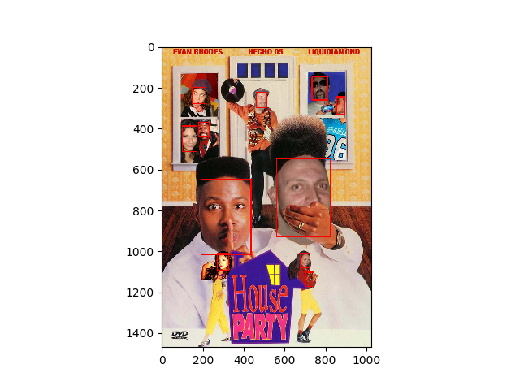

# SSDFaceTrain
 Caffe SSD Face Detector Training Script

## Requires

 **Caffe-SSD:** caffe-ssd you can find at [[here]](https://github.com/weiliu89/caffe))
 
 **WiderFace Dataset:** you need to download [wider_face](http://mmlab.ie.cuhk.edu.hk/projects/WIDERFace/WiderFace_Results.html) ,and make sure you place the dataset at right folder,
 
 ```
 ├── WIDER
 
       └── WIDERfacedet
       
              ├── wider_face_split
              
              ├── WIDER_train
              
              └── WIDER_val     
 ```
                     
 Before you start to train, you need to modify some paths in Makefile
 
 **data_dir:** the path point to WIDER, /pathxxx/WIDER
 
 **wider_dir:** the path point to WIDERfacedet, /pathxxx/WIDER/WIDERfacedet
 
 **lmdb_pyscript:** the path of caffe create_annoset.py, /pathxxx/caffe/scripts/create_annoset.py
 
 **caffe_exec:** the caffe execute file, /pathxxx/caffe/build/tools/caffe
 
 ## Train
 
 Make wider face lmdb data
 ```
 make wider_lmdb
 ```
 
 Train face detector
 ```
 make train
 ```
 
 ## Test
 
 Test on images 
 
 ```
 python scripts/test_on_examples.py model/yufacedetectnet-open-v2.prototxt model/ssdfacedet_iter_9000.caffemodel image/
 ```
 
 note: yufacedetectnet-open-v2.prototxt is design for detecting 35x35 min_face_size in 1080P 
 
 <p align="center">
    
 </p>
 
 ## Ref
 
 There are two respositories this project reference to
 
 **model:** [libfacedetection](https://github.com/ShiqiYu/libfacedetection)
 
 **script:** [MobilenetSSDFace](https://github.com/BeloborodovDS/MobilenetSSDFace)
 
 
 
